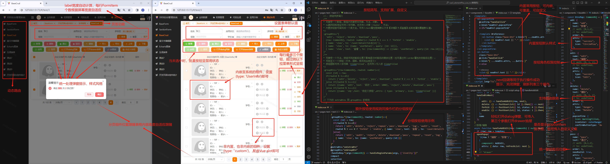
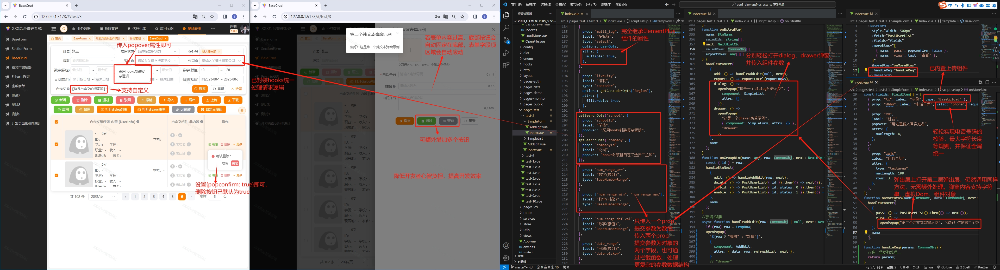
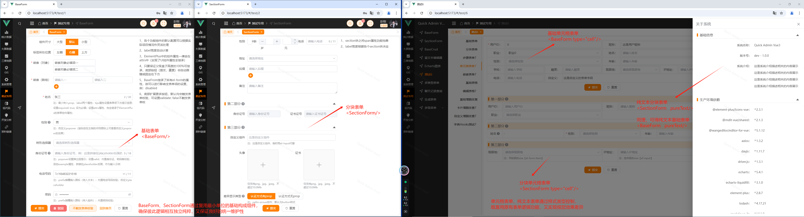
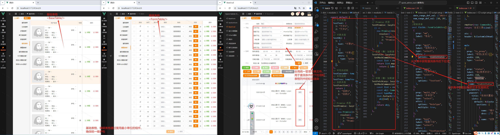
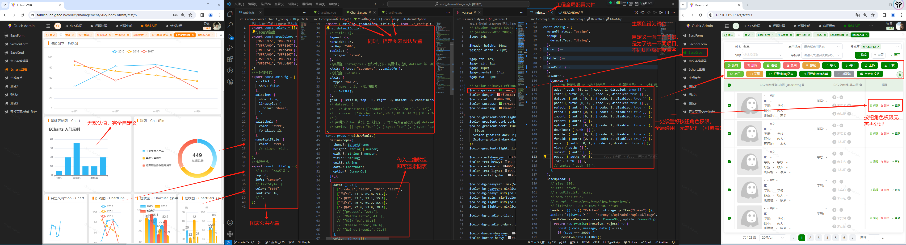
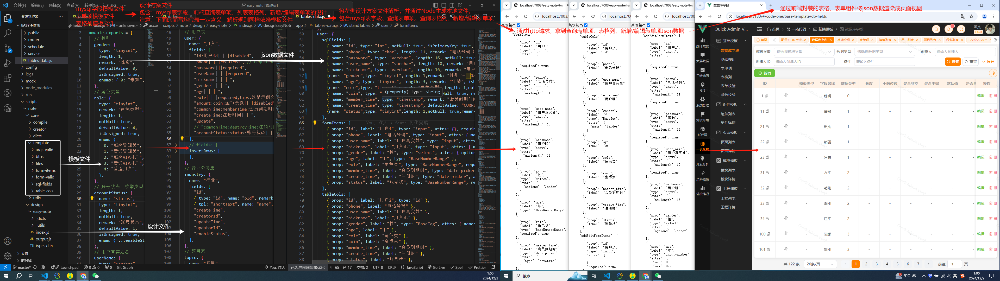

# Quick Admin Vu3

## 一、工程简介

1. 技术栈：Vue3 + ElementPlus + Scss + TypeScript + Eslint + Prettier

## 二、地址链接

### Vue3 版（已经过一个完整企业级项目验证）

在线预览：[Github](https://1583187609.github.io/quick_admin/vue3/preview/#/login)（国外服务，初次加载较慢）、~~[Gitee](https://fanlichuan.gitee.io/quick_admin/vue3/preview/#/login)（暂不可用，服务维护升级）~~

说明文档：[Github](https://1583187609.github.io/quick_admin/vue3/docs)（国外服务，初次加载较慢）、~~[Gitee](https://fanlichuan.gitee.io/quick_admin/vue3/docs)（暂不可用，服务维护升级）~~

仓库地址：[Github](https://github.com/1583187609/quick_admin_vue3)、[Gitee](https://gitee.com/fanlichuan/quick_admin_vue3)

注：现阶段处于升级改造中，极致追求工程移植性、代码复用性、可配置性、开发体验、用户体验……

最新代码：[Gitee docs 分支](https://gitee.com/fanlichuan/quick_admin_vue3/tree/docs/)，含 vitepress 生成的说明文档

### React 版（完善度约 80%）

在线预览：[Github 地址](https://1583187609.github.io/quick_admin/react/preview/#/login)（国外服务，初次加载较慢）、~~[Gitee 地址](https://fanlichuan.gitee.io/quick_admin/react/preview/#/login)（暂不可用，服务维护升级）~~

说明文档：[Github 地址](https://1583187609.github.io/quick_admin/react/docs)（国外服务，初次加载较慢）、~~[Gitee 地址](https://fanlichuan.gitee.io/quick_admin/react/docs)（暂不可用，服务维护升级）~~

仓库地址：[Github](https://github.com/1583187609/quick_admin_react)、[Gitee](https://gitee.com/fanlichuan/quick_admin_react)

## 三、前言概述

### 特性：全继承 + 易使用 + 高内聚 + 低耦合 + 活配置 + 强扩展 + 低代码 + 高效率 + 严统一

- **全继承 + 易使用**：完全继承 ElementPlus 组件属性；命名语义清晰；免写基础逻辑；逻辑解耦……
- **高内聚 + 低耦合**：单一原则、细粒度化、灵活组合、可配置性。
- **活配置 + 强扩展**：内置常用属性、组件（支持自定义内嵌）；支持全局/页面/组件级值覆盖。
- **低代码 + 高效率**：只需专注纯业务逻辑、书写少量代码；高于行业平均效率（页面开发、接口联调、Bug 修复、迭代维护 **各约 30% ~ 50%**）。
- **严统一**：自动计算表单 label 宽、表格列宽；极致统一按钮风格（顺序、间距、样式）、表单校验。

### 创新&特性：

1. **简化表格列渲染**：

   - 内置表格列属性：宽度、未联调提示、占位符、……
   - 内置通用组件：图片（预览、空图、大小）、文本内容（超出省略、点击可弹窗查看全部）、标签（样式、文本）、……
   - 支持内嵌组件：例：UserInfo。

2. **简化按钮书写 & 统一样式风格 & 实现逻辑功能**：

   - 只需写入 add、edit、delete、……，即可实现统一样式、位置顺序等（可覆盖）。
   - 轻松弹出 popover、popconfirm 提示。
   - 简单优雅实现按钮角色权限：只需按钮配置文件中设置一次，即可全局通用。

3. **轻松打开/关闭弹窗**：通过调用 openPopup、closePopup 实现。

4. **轻松统一表单检验**：设置表单项的 tpl 属性，例：phone、password、……

5. **统一管理字典/标签**：整合本地和请求到的字典数据，形成唯一维护的字典文件，通过本地存储减少网络请求次数。

6. **免考虑基础逻辑**：

   - 增删改查免设置表格、表格列基础属性。
   - 表单字段 label 宽度自动计算、自动补全 placeholder 文本、按 enter 键或 change 事件触发搜索。
   - 按钮防抖、加载状态；统一图标、样式；免角色权限逻辑处理。
   - 免弹窗组件引入（dialog、drawer）、基础属性设置。
   - 新增/编辑提交后 —— 提示成功、关闭弹窗、刷新列表，通过简单的 next() 回调完成（可传参覆盖）。
   - ……

7. **封装弹性布局类**：提升静态页面开发效率 **约 30%** 。点击了解弹性布局基础类（布局神器）：[Github 地址](https://1583187609.github.io/produce/flex-layout)（国外服务，初次加载较慢）、~~[Gitee 地址](http://fanlichuan.gitee.io/produce/flex-layout/index.html)（暂不可用，服务维护升级）~~

## 四、图例简述

1. 增删改查：表格列 + 表格列渲染 + 额外按钮组 + 操作栏按钮组

2. 增删改查：表单字段 + 表单校验 + 弹出层（dialog、drawer、popover、popconfirm）

3. 表单类型：基础表单 + 分块表单 + 单元格格表单 + 纯文本表单

4. 表格类型：基础表格 + 可编辑表格 + 增删改查表格（全局统一字典/标签）

~~5. 树：权限树 + 其他树（待完善）~~

6. 工程移植性：Echarts 图表（全局/页面/组件分层级默认配置、轻松渲染） + 全局默认配置（可覆盖） + 主题换肤 + 按钮角色权限控制

7. 后续低码计划：一站式前后端低码设计方案

建立模板（mysql 字段、表单项、表格列）-> 设计方案（简版 JSON：含数据库表、查询表单项、查询表格列、新增/编辑表单列设计）-> 解析成标准 JSON -> 前端解析 JSON，页面渲染

## 五、说明文档

### 概述

通过如下措施：
1、从目标组件中获取摘要描述信息，提示信息（tip、warning、danger、detail 等）  
2、从示例组件中获取（示例代码、实际 UI 效果）、摘要描述信息、提示信息（tip、warning、danger、detail 等）  
3、通过 vue-docgen-api 从目标组件中获取 defineProps、defineEmits、defineExpose、defineSlots 中获取：名称、描述、ts 类型、默认值  
4、从.ts 或.vue 文件中获取 ts 类型

能够实现：
只需在源码中写好注释，即可通过 node 命令生成说明文档，大大降低了了说明文档的维护难度。

## 六、支持

1. 待完善

## 七、其他后记

1. 以上文字说明、图片示例，未完全呈现已有功能，因时间精力有限，后续再完善此文档。
2. Quick Admin Vue3 核心代码（src/core 和 src/config），已经过一个完整企业级项目验证，稳定运行至今并趋于成熟。
3. 欲知已完善或待完善某些功能，可查看任务清单（[Github](https://github.com/1583187609/quick_admin_vue3/blob/dev/_Task_List.md) 或 [Gitee](https://gitee.com/fanlichuan/quick_admin_vue3/blob/master/_Task_List.md)），清单未实时更新，有滞后情况

## 八、联系方式

**微信**：fic3014  
**邮箱**：1583187609@qq.com
