# Quick Admin Vu3

## 前言

很喜欢下面这样两句话：

- 代码是写给人看的，只是恰好机器能够执行。
- 过早优化是万恶之源。

## 项目简介

### 摘要

1. 是一款对**开发体验、用户体验、扩展维护、工程移植、程序性能、开发效率**不断**追求极致**的中后台管理系统框架。
2. 采用最新技术栈：Vite5.4 + Vue3.5 + Pinia + TypeScript + ElementPlus + Eslint + Prettier + LsLint + Husky。
3. **最新代码仓库地址**：[https://gitee.com/fanlichuan/quick-admin-vue3-core](https://gitee.com/fanlichuan/quick-admin-vue3-core)

### 亮点

1. 功能全面：常用页面（用户、角色、权限、日志）、常用组件（多种表格、多种表单、多种增删改查列表、多种图表、图片、文本）、常用功能（登录/出、权限管理）、路由（静态、动态、自动）、页签（缓存）、权限（页面、按钮）、链接（内部、外部）、主题（颜色、布局、尺寸）、Mock、水印、国际化、~~监控（性能、异常）~~、低码平台（配置 JSON、~~拖拽~~、~~AI~~）……
2. 全局配置：**创新性**地提供了可配置全局弹窗、按钮、字典、模板的机制。一处配置，全局生效，可子级覆盖父级配置。
3. 低码高效：免写逻辑（全局配置、集中处理公共逻辑）、简写代码（快捷属性、模板属性、提取逻辑）、代码生成（编辑器代码片段、Node 脚本生成、~~AI 生成~~）。使得能够极大降低开发者心智负担，显著提升开发效率，高度统一逻辑样式。
4. 追求极致：从扩展维护、开发体验、用户体验方面，在基于扩展性的前提下，不断整合逻辑代码，完善各种细节。
5. 文件生成：基于 Node 和相关工具，提供了 Vue 文件、API 文件、组件使用说明文档生成脚本。
6. 渐进式低码方案：代码片段、JSON 渲染、快捷属性、模板配置、全局配置、一文件生成（进行中：Node 脚本、AI 处理）、一站前后端代码
7. 工程移植性：基于全局配置 JSON 数据和全局 SASS 变量体系，使得工程移植性配置更加容易。

注：带删除线的为进行中（待完善）状态。

### 进度

1. 截止 2026 年 5 月 17 日，Vue3 版本已经过**两次**重大升级改造、**三个**完整企业级项目验证而稳定。
2. 目前通过脚本生成的组件使用说明文档只能本地启动（npm run docs:dev）查看（受 SSR 影响），且未精细化打磨，待后续完善后择机开源推广。

## 地址链接

### Vue3 版（已经历两次重大升级改造、三个完整企业级项目验证）

在线预览：[自用站点](https://quickadmin.kongjz.com/#/login)（最新，推荐）、[Github](https://1583187609.github.io/quick_admin/vue3/preview/#/login)（旧版，国外服务，初次加载较慢）、~~[Gitee](https://fanlichuan.gitee.io/quick_admin/vue3/preview/#/login)（暂不可用，服务维护升级）~~

说明文档：[自用站点](https://quickadmin.kongjz.com/quick_admin/vue3/docs)（推荐）、[Github](https://1583187609.github.io/quick_admin/vue3/docs)（国外服务，初次加载较慢）、~~[Gitee](https://fanlichuan.gitee.io/quick_admin/vue3/docs)（暂不可用，服务维护升级）~~

仓库地址：[Github](https://github.com/1583187609/quick_admin_vue3)、[Gitee](https://gitee.com/fanlichuan/quick_admin_vue3)

### React 版（初版完善度约 80%）

在线预览：[Github](https://1583187609.github.io/quick_admin/react/preview/#/login)（国外服务，初次加载较慢）、~~[Gitee](https://fanlichuan.gitee.io/quick_admin/react/preview/#/login)（暂不可用，服务维护升级）~~

说明文档：[Github](https://1583187609.github.io/quick_admin/react/docs)（国外服务，初次加载较慢）、~~[Gitee](https://fanlichuan.gitee.io/quick_admin/react/docs)（暂不可用，服务维护升级）~~

仓库地址：[Github](https://github.com/1583187609/quick_admin_react)、[Gitee](https://gitee.com/fanlichuan/quick_admin_react)

## 快速了解

### 全继承 + 易使用 + 高内聚 + 低耦合 + 活配置 + 强扩展 + 低代码 + 高效率 + 严统一

- **全继承 + 易使用**：完全继承 ElementPlus 组件属性；命名语义清晰；免写基础逻辑；逻辑解耦……
- **高内聚 + 低耦合**：单一原则、细粒度化、灵活组合、可配置性。
- **活配置 + 强扩展**：内置常用属性、组件（支持自定义内嵌）；支持局部配置覆盖。
- **低代码 + 高效率**：只需专注纯业务逻辑、书写少量代码；高于行业平均效率（页面开发、接口联调、Bug 修复、迭代维护 <span style="color:red;">**约 100%**</span>）。
- **严统一**：执行同样逻辑（自动计算表单 label 宽、表格列宽、……），确保数据来源唯一，实现逻辑（表单校验、提示文案、……）、UI（按钮和表单控件等的间距、样式、文案、……）极致统一。

### 创新：

1. **全局按钮**：

- 只需写入 add、edit、delete、……，即可实现样式、顺序等统一。
- 针对危险按钮（例：删除）自带确认提示（popconfirm：确认删除吗？）。
- 简单优雅实现按钮角色权限：只需按钮配置文件中设置一次，即可全局通用。

2. **全局弹窗**：

- 调用 `openPopup('标题','组件','dialog')`、`closePopup()` 打开/关闭弹窗，无需设置一堆弹窗属性及变量。
- 设置好一堆默认值属性，可保证全局统一。

3. **全局字典**：

- 统一管理同步、异步字典的数据，统一存取规则。
- 通过 hooks 处理响应式数据、使用本地存储，可实现请求优化（减少请求次数）。
- 表单下拉项（select）属性 options 可直接写字典名称（例：D_EnableStatus），利于快速开发。
- 统一管理表格列标签（el-tag）不同状态的样式

4. **表格列类型**：

- 不同类型列，拥有不同列属性：宽度、空值占位符、渲染类型（文本、图片、内置组件、内嵌组件等）……
- 内置通用组件：图片（预览、空图、大小）、文本内容（超出省略、点击可弹窗查看全部）、标签（样式、文本）、……
- 支持内嵌组件：例：UserInfo。

5. **字段模板**：

- 配置常用模板，设置 tpl 属性，即可免配置表单项属性（prop、label、控件属性、……）、表格列属性（列头文本、列宽、……），也可传入覆盖。
- 减少代码、复杂逻辑书写，保证全局统一，例：配置好电话号码字段模板（含正则校验、最小/大长度、……），使用时`{tpl: 'T_Phone'}`，也可传入属性覆盖。
- 模板非必须使用

6. **全局配置**：

- 以上提到的创新点涉及到的所有配置都可按需配置，满足不同工程不同需求，增强工程移植性，代码复用能力。
- 免考虑基础逻辑，降低开发心智负担
  - 增删改查免设置表格、表格列基础属性。
  - 表单字段 label 宽度自动计算、自动补全 placeholder 文本、按 enter 键或 change 事件触发搜索。
  - 按钮防抖、加载状态；统一图标、样式；免角色权限逻辑处理。
  - 免弹窗组件引入（dialog、drawer）、基础属性设置。
  - 新增/编辑提交后 —— 提示成功、关闭弹窗、刷新列表，通过简单的 next() 回调完成（可传参覆盖）。
  - ……

7. **弹性布局基础类**：布局神器，提升静态页面开发效率 <span style="color:red;">**约 30%**</span> 。点击了解弹性布局基础类（布局神器）：[Github 地址](https://1583187609.github.io/produce/flex-layout)（国外服务，初次加载较慢）、~~[Gitee 地址](http://fanlichuan.gitee.io/produce/flex-layout/index.html)（暂不可用，服务维护升级）~~

8. **低码方案**：

- 预设代码片段：Vs Code 编辑器内置代码片段，输入关键词即可快速生成代码模板
- 可视化低码平台：配置极简 JSON ，通过本地 Node 服务生成 .vue, .ts 文件
- Node 脚本命令：通过配置好页面模板、模块模板，输入 npm 命令即可批量生成文件
- AI 生成：待完善

## 功能图例

1. 增删改查：表格列 + 表格列渲染 + 额外按钮组 + 操作栏按钮组

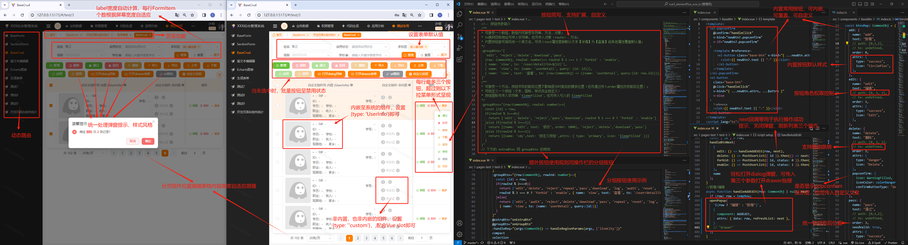

2. 增删改查：表单字段 + 表单校验 + 弹出层（dialog、drawer、explain、popconfirm）

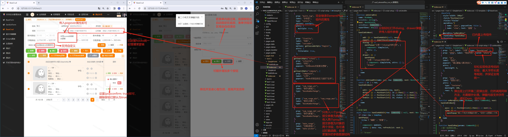

3. 表单类型：基础表单 + 分块表单 + 单元格格表单 + 纯文本表单

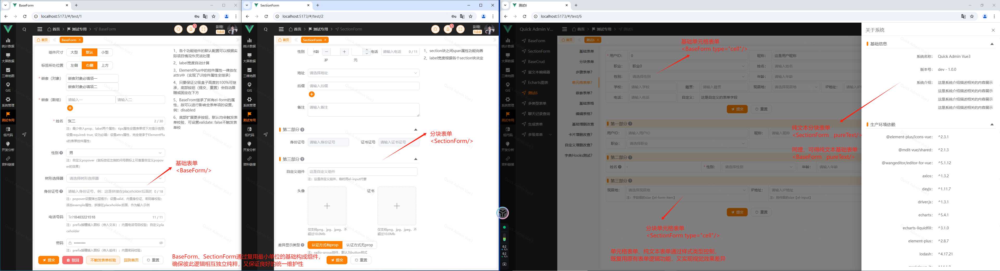

4. 表格类型：基础表格 + 可编辑表格 + 增删改查表格（全局统一字典/标签）

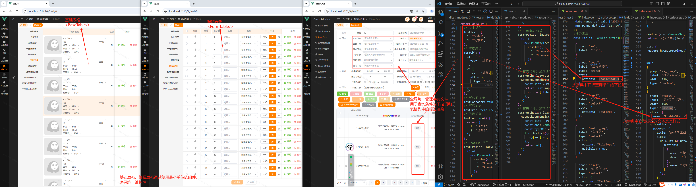

<!-- ~~5. 树：基础树 + 过滤树（待完善）~~ -->

<!--  -->

5. 工程移植性：Echarts 图表（全局/页面/组件分层级默认配置、轻松渲染） + 全局默认配置（可覆盖） + 主题换肤 + 按钮角色权限控制

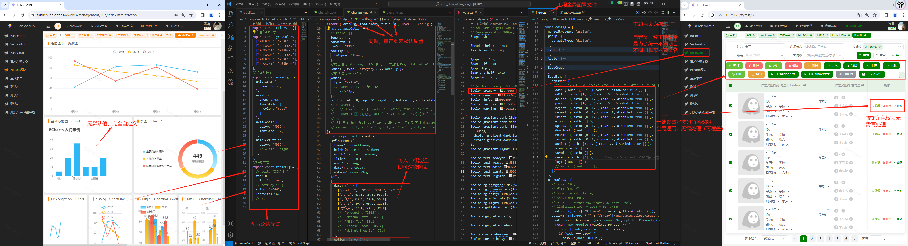

6. 低码平台能力展示：配置极简 JSON，即可生成 Vue 文件，并支持效果预览和代码预览

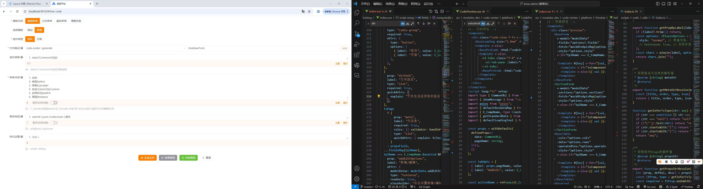
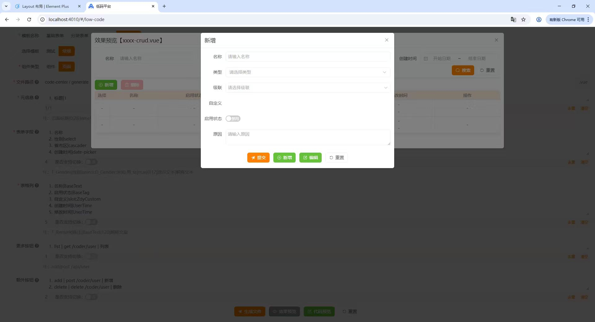
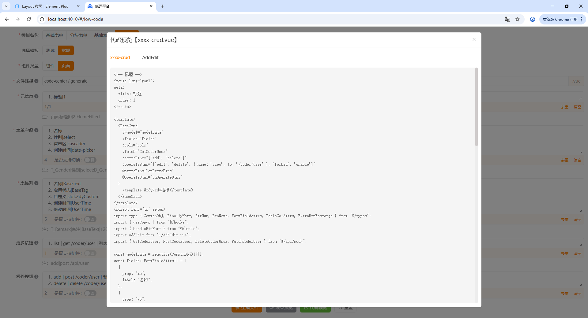

<!-- 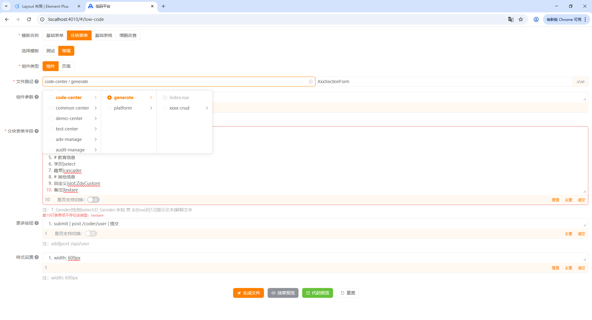 -->

7. 全栈低码开发：

（1）一站式前后端低码设计方案示例：Node + MySql

仓库地址：[https://gitee.com/fanlichuan/easy-note](https://gitee.com/fanlichuan/easy-note)

建立模板（mysql 字段、表单项、表格列）-> 设计方案（简版 JSON：含数据库表、查询表单项、查询表格列、新增/编辑表单列设计）-> 解析成标准 JSON -> 前端解析 JSON，页面渲染

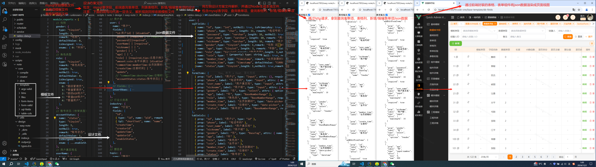

（2）go 后端快速开发框架（延续 Quick Admin 风格）：Go + Gin + PostgresSql/MySql + 内存/Redis 缓存 + 插拔式设计

仓库地址：[https://gitee.com/fanlichuan/quick-driver](https://gitee.com/fanlichuan/quick-driver)

## 安装步骤

- 克隆

```
# Gitee
git clone https://gitee.com/fanlichuan/quick_admin_vue3
# GitHub
git clone https://github.com/1583187609/quick_admin_vue3
```

- 安装 & 启动

```
# 安装包
npm run install
# 启动项目
npm run dev
# 启动文档
npm run docs:dev
```

- 打包

```
# 打包项目
npm run build:simple
# 打包文档
npm run docs:dev
```

- 代码格式化

```
# eslint 检测代码
npm run lint:eslint

# prettier 格式化代码
npm run lint:prettier

# stylelint 格式化样式
npm run lint:stylelint
```

## 项目截图

1. 登录页  
   
2. 首页  
   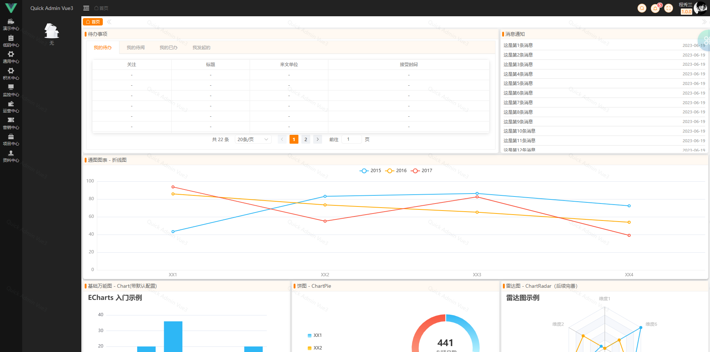
3. 列表页  
   
4. 图表页  
   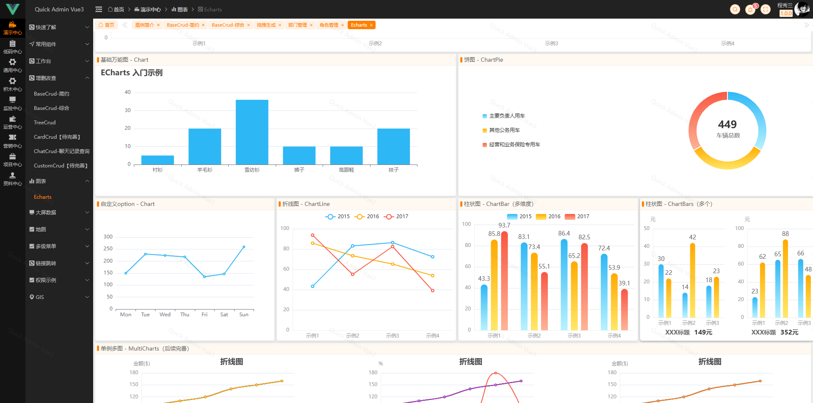
5. 大屏页  
   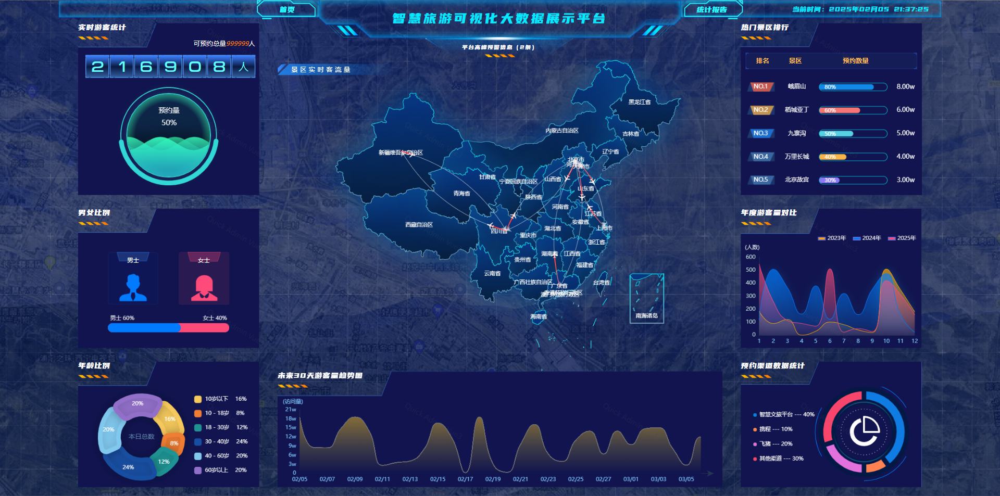

## 文档截图

1. 首页简介  
   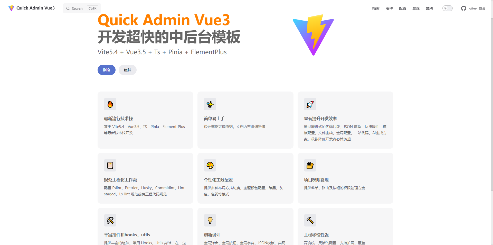
2. 组件说明  
   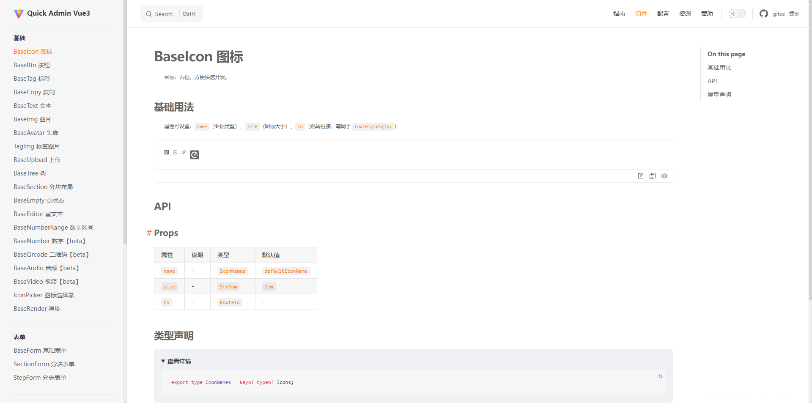
3. 全局配置  
   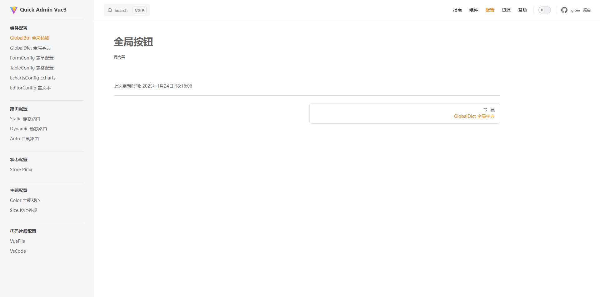

## 文件目录

```text
  Quick Admin Vue3
  ├── .husky # git 提交钩子配置
  ├── .vscode # 本地 vscode 配置
  │ └── settings.json
  ├── node_modules
  ├── public # 公共资源
  │ ├── static # 静态资源
  │ ├── ico.svg
  │ └── vite.svg
  ├── src # 项目主要逻辑代码均在里面
  │ ├── apis # 当前工程真实的 API
  │ ├── api-mock # MOCK 的 API
  │ ├── assets # 静态资源 css 图片等
  │ ├── components # 全局基础组件（任意工程适用）
  │ ├── config # 针对于全局基础组件（src/components）的配置
  │ ├── dicts # 全局字典管理
  │ ├── enums # 全局 Ts 枚举管理（可能会移除）
  │ ├── hooks # 全局 hooks
  │ ├── langs # 全局国际化处理（汇总各个模块的 `_langs` 文件夹内容）
  │ ├── layout # 页面布局中心
  │ ├── router # 路由管理中心
  │ ├── services # 全局服务层中心（后续可能会改动）
  │ │ └── http # 请求方法体封装（一个项目可能需要多个封装类型，所以单独提取成一个文件夹）
  │ ├── store # 全局状态管理（pinia）
  │ ├── utils # 全局工具方法
  │ ├── views # 非业务模块的页面，例：登录页
  │ │ └── `_tpl` # 页面、组件开发的模板代码
  │ │ └── `_components` # 工程的基础组件（只适用于当前工程）
  │ │ └── **model** # 各个模块（见下面第三部分示例）
  │ │ └── error.vue # 403, 404, 500 等状态码的页面
  │ ├── modules # 业务模块页面（对应着菜单中的页面，文件夹和文件嵌套跟菜单嵌套保持一致）
  │ ├── modules-dev # 供开发者单元测试、组件示例使用的模块（仅开发环境可见）
  │ ├── utils # 常用的工具函数
  │ ├── App.vue # 入口根组件
  │ ├── main.ts # 入口文件配置
  │ └── vite-config # vite 配置插件收录，供 vite.config.ts 使用（有利于代码简洁，增强工程移植性）
  ├── .env # 环境变量配置
  ├── .env.dev
  ├── .env.pre
  ├── .env.prod
  ├── .env.test
  ├── .env.local # 本地设置，可选
  ├── .eslintrc.cjs # eslint 配置
  ├── .gitnore
  ├── .ls-lint.yml # 文件命名校验
  ├── .npmrc
  ├── .prettierignore
  ├── .prettierrc # prettierrc 配置
  ├── .stylelintignore
  ├── .stylelintrc.cjs # stylelintrc 配置
  ├── .commitlint.config.cjs # git 提交规范 配置
  ├── package-lock.cjs
  ├── package-lock.json
  ├── package.json
  ├── tsconfig.json # ts 配置
  └── README.md
```

## 后台接口

项目中使用的接口全为 Mock 数据，均在浏览器端运行生成。

## 赞助支持

## 联系方式

**微信**：fic3014  
**邮箱**：1583187609@qq.com
